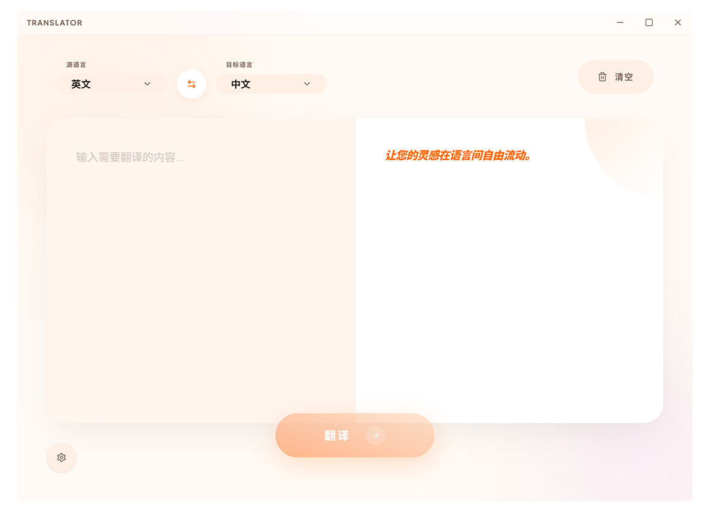

<p align="center">
  
</p>

<h1 align="center">Translator</h1>

<p align="center">
  一款基于 <strong>Tauri v2</strong> 构建的现代桌面翻译应用，接入 OpenAI 兼容 API，支持流式输出与自定义提示词。
</p>

<p align="center">
  
  
  
  
  
</p>

---

## ✨ 功能特性

- 🌊 **SSE 流式翻译** — 实时逐字输出翻译结果，体验如同与 AI 对话
- 🌐 **多语言支持** — 内置中文、英文、日文、韩文互译
- 🔌 **多服务管理** — 支持添加多个 OpenAI 兼容 API 端点，一键切换
- 📝 **自定义提示词** — 可编辑系统提示词模板，支持 `{{sourceLang}}`、`{{targetLang}}` 等变量替换
- 🧠 **思考内容过滤** — 自动过滤模型推理过程（`<think>` 标签和 `reasoning_content` 字段）
- 🎨 **精致 UI** — 毛玻璃效果、渐变装饰、微交互动画，自定义无边框窗口
- ⚡ **语言互换** — 一键交换源语言与目标语言，同时交换已翻译内容
- 💾 **设置持久化** — 所有偏好设置通过 localStorage 自动保存

## 🛠 技术栈

| 层 | 技术 |
|---|---|
| 前端框架 | React 19 + TypeScript 6 |
| 构建工具 | Vite 8 |
| 样式方案 | Tailwind CSS v4 + shadcn/ui |
| 桌面框架 | Tauri v2 (Rust) |
| HTTP 请求 | @tauri-apps/plugin-http |
| 包管理器 | pnpm |
| 图标库 | lucide-react |

## 📦 前置要求

在开始之前，请确保已安装以下工具：

- [Node.js](https://nodejs.org/) (>= 18)
- [pnpm](https://pnpm.io/) (>= 10)
- [Rust](https://www.rust-lang.org/tools/install) (>= 1.77.2)
- [Tauri v2 CLI 依赖](https://v2.tauri.app/start/prerequisites/) — 按照官方文档安装适用于你操作系统的系统依赖

## 🚀 快速开始

### 1. 克隆仓库

```bash
git clone https://github.com/cyhuajuan/translator.git
cd translator
```

### 2. 安装依赖

```bash
pnpm install
```

### 3. 启动开发环境

```bash
# 启动完整的 Tauri 桌面应用（包含前端热更新）
pnpm tauri dev
```

> **注意：** 翻译功能依赖 `@tauri-apps/plugin-http`，仅在 `pnpm tauri dev` 模式下可用。`pnpm dev` 仅启动前端开发服务器，API 请求会因缺少 Tauri 运行时而失败。

### 4. 配置翻译服务

1. 点击界面左下角的 ⚙️ 设置按钮
2. 进入 **高级** 选项卡
3. 配置你的翻译服务：填写 API Base URL、API Key 和模型名称
4. 支持任何兼容 OpenAI Chat Completions API 的服务（OpenAI、DeepSeek、通义千问等）

## 📁 项目结构

```
translator/
├── src/                          # 前端源码 (React)
│   ├── App.tsx                   # 主应用组件 (翻译界面 + 自定义标题栏)
│   ├── main.tsx                  # React 入口
│   ├── index.css                 # 全局样式 & Design Tokens
│   ├── components/
│   │   ├── SettingsDialog.tsx    # 设置弹窗 (翻译偏好 + 提示词 + 服务管理)
│   │   └── ui/                   # shadcn/ui 基础组件
│   ├── hooks/
│   │   └── useSettings.tsx      # 设置状态管理 (localStorage + Context)
│   └── lib/
│       ├── translate.ts          # 翻译核心逻辑 (SSE 流式解析 + 思考过滤)
│       └── utils.ts              # 工具函数
├── src-tauri/                    # Tauri 后端 (Rust)
│   ├── src/
│   │   ├── main.rs               # Rust 入口
│   │   └── lib.rs                # Tauri Builder 配置
│   ├── tauri.conf.json           # Tauri 应用配置
│   └── capabilities/
│       └── default.json          # 权限声明
└── docs/
    └── preview.png               # 应用预览图
```

## 📜 可用命令

| 命令 | 说明 |
|---|---|
| `pnpm install` | 安装所有依赖 |
| `pnpm dev` | 仅启动前端开发服务器 (无 Tauri 运行时) |
| `pnpm tauri dev` | 启动完整 Tauri 桌面应用（推荐） |
| `pnpm tauri build` | 构建生产版本安装包 |
| `pnpm build` | 仅构建前端资源 |
| `pnpm lint` | 运行 ESLint 代码检查 |

## 🎨 设计系统

项目采用名为 **Kinetic Polyglot** 的自定义设计系统：

- **主色调：** `#FF6D00` (活力橙)
- **字体：** Plus Jakarta Sans + Geist Variable
- **视觉风格：** 大圆角卡片、毛玻璃磨砂效果、柔和渐变、微交互动画
- **颜色语义：** 采用 Material Design 3 色彩命名规范 (`surface-container-*`, `on-surface`, `primary` 等)

## 🔧 提示词模板

系统提示词支持以下模板变量，在翻译时自动替换：

| 变量 | 说明 | 示例 |
|---|---|---|
| `{{sourceLang}}` | 源语言英文名 | Chinese |
| `{{targetLang}}` | 目标语言英文名 | English |
| `{{sourceLangCode}}` | 源语言 ISO 代码 | zh-CN |
| `{{targetLangCode}}` | 目标语言 ISO 代码 | en |

默认提示词：

```
你是一位专业的翻译专家。请将以下{{sourceLang}}文本翻译为{{targetLang}}，
只输出翻译结果，不要添加任何解释或额外内容。
```

## 📄 许可证

[MIT](LICENSE)
